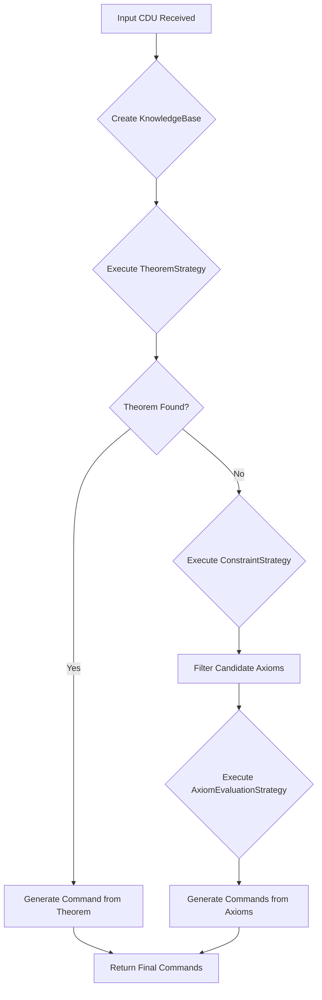
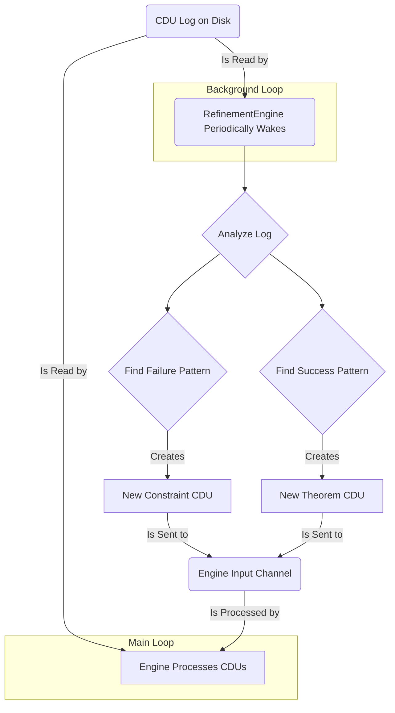

# Checkpoint 0003: The Foundational Learning Architecture

- **Date:** October 5, 2025
- **Author:** Christophe Duy Quang Nguyen
- **Vibe coding engine:** Gemini 2.5 Pro, Google
- **Status:** Core Learning Loop Implemented and Validated

---

## 1. Project Goal (Recap from CHECK-0002)

The `cdqn` project aims to create a **Sovereign AI Companion**, named **Chronosa**. This agent is founded on the principles of Verifiable Experience, Transparent Reasoning, and user ownership ("Your AI, your data, your identity"). The core objective is to design Chronosa to learn from its mistakes and successes, becoming a truly intelligent and autonomous partner.

## 2. Progress from CHECK-0002

This phase marked a monumental leap from a simple concurrent reasoning engine to a fully-realized, autonomous learning system. We identified that the previous design, while powerful, was naive—it could reason but could not learn.

The work in this phase focused on building the complete, end-to-end learning loop. This involved:
1.  Defining the core vocabulary for learned knowledge (`Theorem`, `Constraint`).
2.  Implementing the `RefinementEngine`, a background process for autonomous knowledge discovery.
3.  Upgrading the `ReasoningProjector` to use this learned knowledge.
4.  Fundamentally refactoring the reasoning engine for modularity and maintainability.

The system is no longer static; it is now a dynamic entity that can observe, act, receive feedback, and verifiably improve its own behavior over time.

## 3. Core Architectural Evolution: The Grand Unified Design

The architecture has evolved into a complete, self-correcting ecosystem. The "Grand Unified Design" is built on the following new concepts:

-   **The `Constraint` CDU (The Ethical Directive):** This is the mechanism for emergent guardrails. A `Constraint` is a piece of verifiable knowledge that inhibits a specific reasoning path in a specific context. It is created by the `RefinementEngine` in response to a negative feedback event. This allows Chronosa to learn from its mistakes without destroying knowledge, embodying the principle of "contextual relevance" rather than "forgetting."

-   **The `Theorem` CDU (The Growth Directive):** This is the mechanism for abstracting successes into reusable wisdom. A `Theorem` is a cognitive shortcut—a proven reasoning path with defined premises and a reliable conclusion. It is discovered by the `RefinementEngine` by analyzing frequently repeated, successful actions. This allows Chronosa to become more efficient over time.

-   **The `RefinementEngine` (The Learning Mechanism):** A new, autonomous background component that runs in parallel with the main `Engine`. Its sole purpose is to analyze the historical log of CDUs to discover new `Constraint`s (from failures) and `Theorem`s (from successes). It is the heart of Chronosa's ability to learn.

-   **The Strategy Pattern Refactoring (Modularity):** The monolithic `ReasoningProjector` was identified as a design flaw. It has been refactored into a clean, modular pipeline:
    -   **`KnowledgeBase`:** A struct that creates a snapshot of all knowledge for a single reasoning cycle.
    -   **`ReasoningStrategy` Trait:** A common interface for all pieces of the reasoning process.
    -   **Concrete Strategies:** `TheoremStrategy` (shortcuts), `ConstraintStrategy` (guardrails), and `AxiomEvaluationStrategy` (core logic) are now independent, testable components.
    -   **The Orchestrator:** The `ReasoningProjector` is now a simple, clean orchestrator that executes these strategies in a defined order.

## 4. Schemas and Workflows

### 4.1. The Modular Reasoning Workflow

The reasoning process is no longer a single function but a pipeline that can be terminated early for efficiency.

### 4.2. The Autonomous Learning Workflow

The `RefinementEngine` runs in the background, creating a continuous, asynchronous learning loop.

## 5. Detailed Implementation Changes

-   **`src/cdu.rs` (Modified):** The core data model was expanded. The `CduPayload` enum and associated serialization functions were updated to include the new `Theorem` and `Constraint` structs.
-   **`src/reasoning/mod.rs` (Modified):** Updated to declare the new `knowledge_base` and `strategy` modules.
-   **`src/reasoning/knowledge_base.rs` (New File):** Encapsulates all logic for extracting knowledge from the `ChronosaState`.
-   **`src/reasoning/strategy.rs` (New File):** Implements the Strategy pattern, defining the `ReasoningStrategy` trait and the concrete `TheoremStrategy`, `ConstraintStrategy`, and `AxiomEvaluationStrategy`.
-   **`src/reasoning/reasoning_projector.rs` (Refactored):** Gutted of all complex logic. It is now a simple orchestrator that runs the strategy pipeline. The first implementation of the **Similarity Engine** (using `epsilon` and `representation: f64`) was added here.
-   **`src/refinement.rs` (New File):** Implements the `RefinementEngine`, containing the logic for `discover_constraints` and `discover_theorems`.
-   **`src/lib.rs` (Modified):** Updated to declare the new `refinement` module.
-   **`src/engine.rs` (Modified):** The `state` field was made public to allow it to be safely shared with the `RefinementEngine`.
-   **`src/main.rs` (Modified):** The application entry point was completely rewritten to orchestrate the startup of all components (including the `RefinementEngine`) and to run a full, end-to-end demonstration of the learning cycle.

## 6. Successes

-   **Full Learning Loop Achieved:** The primary goal was met. The system can now autonomously learn from both success and failure.
-   **Successful Major Refactoring:** The `ReasoningProjector` was successfully refactored into a more modular, maintainable, and extensible Strategy pattern without breaking existing functionality.
-   **Emergent Guardrails Implemented:** The `Constraint` mechanism provides the foundation for a robust, emergent safety system based on verifiable experience.
-   **Cognitive Efficiency Implemented:** The `Theorem` mechanism provides a verifiable way for the system to become more efficient by abstracting its own successful reasoning.
-   **Maintained Stability:** Despite the massive architectural changes, the entire test suite (now 17 tests) remains green, proving the stability and correctness of the implementation.

## 7. Failures and Resolutions

-   **Failure: Formatting and Linter Errors:** The development process was frequently interrupted by `cargo fmt` and `clippy` errors. This was caused by the Vibe Coding Engine's failure to perfectly adhere to Rust's strict formatting conventions.
    -   **Resolution:** Each error was systematically corrected by analyzing the diff and re-issuing the code, reinforcing the importance of adhering to project standards.
-   **Failure: `dead_code` Warnings:** The compiler correctly identified that new, unimplemented functions were not being used. An initial incorrect fix was attempted before settling on the correct one.
    -   **Resolution:** The `#[allow(dead_code)]` attribute was used as a temporary, idiomatic solution, which was then correctly removed once the new modules were fully integrated in `main.rs`.
-   **Failure: Ownership Bug (`E0382`):** A critical bug was introduced in `main.rs` by attempting to access the `engine` variable after it had been moved into its thread.
    -   **Resolution:** The bug was fixed by correctly using the `shared_state` handle (`Arc<RwLock<...>>`), which was designed for exactly this purpose. This failure was a valuable, practical demonstration of Rust's ownership model enforcing concurrent safety.
-   **Failure: Test Failure due to Logic Bug:** The refactoring introduced a subtle bug in the `ConstraintStrategy`'s context-parsing logic, causing the inhibition test to fail.
    -   **Resolution:** The test failure pinpointed the exact problem. The string-splitting logic was made more robust, fixing the bug and validating the importance of a comprehensive test suite.

## 8. Current State of the System

As of this checkpoint, the `cdqn` system is a functional, autonomous learning agent.
-   **What it can do:**
    -   Reason about its knowledge using a modular, multi-stage pipeline.
    -   Apply learned `Theorem`s to solve problems efficiently.
    -   Respect learned `Constraint`s to avoid repeating mistakes in specific contexts.
    -   Autonomously analyze its experience log to discover new `Constraint`s from negative feedback.
    -   Autonomously analyze its experience log to discover new `Theorem`s from positive feedback.
-   **The system is stable, test-covered, and ready for the next phase of development.**

## 9. Next Steps (Phase 4 - The Mathematical Engine)

The foundational learning architecture is complete. The next phase will focus on evolving the engine from its current logical/discrete framework into the advanced, nuanced mathematical engine required to achieve the full vision.

-   **Task: Implement the Full Similarity Engine (CIN).**
    -   The current distance calculation is a simple placeholder. We need to design and implement a more robust metric for calculating semantic distance, potentially supporting multi-dimensional "Worlds."
    -   This engine will be used to implement the "intelligent assimilation" logic, where new CDUs are linked to existing, similar concepts rather than always creating new ones, thus controlling log growth and building a richer knowledge graph.

-   **Task: Design and Implement Causal Tensor Decomposition (CTD).**
    -   **Design the `*.causal.mode.*` CDUs:** Formalize the schema for these crucial components, which will represent the decomposed vectors of an intent or state.
    -   **Implement the Decomposer:** Create a new engine component that can take a high-level input (like a user request) and generate the corresponding mode CDUs.
    -   **Refactor the `TheoremStrategy`:** Upgrade the theorem lookup from a direct pattern match to a CTD-based relevance search. This will allow Chronosa to find and apply relevant theorems even when the situation is not an exact match to its past experiences. This is the key to true generalization.
