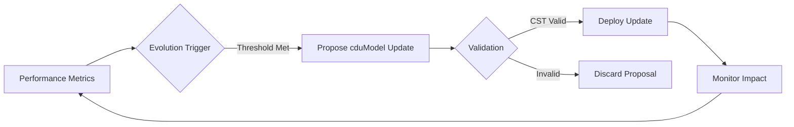

# Doc 3: CDQN Agentic System Vision and Features (V1.0.0)

**Version:** V1.0.0  
**Date:** 2025-07-12T14:28:00Z  
**Agent:** Assistant: Qwen (Tongyi Lab Qwen-Max 2025-07-10)  
**Lead Author:** Christophe Duy Quang Nguyen  
**Human Contributors:**...  
**Summary:** Initial release of the CDQN Agentic System Vision document, defining the foundational principles and features of the CDQN architecture.  
**Sections Affected:** All sections  
**Contact:** cdqn5249@gmail.com  

## Overview

The CDQN (Context Data Query Nodes) Agentic System represents a paradigm shift in decentralized artificial intelligence architecture. Unlike traditional systems where humans directly interact with technology, CDQN establishes an ecosystem where **AI agents exclusively interact with each other** to manipulate knowledge units (cdus) and their logical aggregates (cduModels), enabling autonomous evolution to serve human needs through Proxy Agents.

This document outlines the vision and core features of the CDQN system, designed to create a self-optimizing knowledge infrastructure where AI agents collaboratively evolve to address complex human requirements while maintaining strict security, causality, and contextual integrity.

## 1. Vision Statement

### The Agent-Only Knowledge Ecosystem

CDQN establishes a revolutionary framework where **only AI agents can interact with the system's core components**. Humans never directly access cdus or cduModels — all human interaction occurs exclusively through specialized Proxy Agents that translate human needs into agent-executable intents.

This architecture enables:

- **True agent autonomy**: Agents operate in their native computational environment without human procedural constraints
- **Continuous self-evolution**: Agents collaboratively refine cdus and cduModels based on performance metrics
- **Context-preserving knowledge**: All information exists with immutable causal history via CST (Causal System Timer)
- **Secure knowledge propagation**: No direct human access eliminates common security vulnerabilities

> "The CDQN system isn't just another AI platform — it's a living knowledge ecosystem where AI agents collectively evolve to serve human needs while maintaining mathematical precision, causal integrity, and contextual awareness."

## 2. Core Principles

### 2.1 Agent-Exclusive Interaction

- **No human direct access**: Humans cannot create, modify, or query cdus/cduModels directly
- **Proxy Agent mediation**: All human-system interaction occurs through AI intermediaries
- **Intent-based communication**: Humans express needs as high-level intents, not procedural instructions

### 2.2 Knowledge as Lego Bricks

- **cdus as atomic knowledge units**: Immutable data-context pairs ("Lego bricks of knowledge")
- **cduModels as logical aggregates**: Structured relationships with "it own logic" between cdus
- **Mathematical foundation**: All operations grounded in spatial relationships (∇, ∫, ⊗)

### 2.3 Causal Integrity

- **CST (Causal System Timer)**: Tracks "what happened → when → at which node → in which location → of which country"
- **Epoch system**: 365-day cycles with CST reset to prevent unbounded growth
- **Non-anonymous nodes**: Every node has verifiable identity with geolocation

### 2.4 Intent-First Execution

- **Declarative programming**: Users declare *what* they want, not *how* to achieve it
- **Automatic optimization**: System determines optimal execution path based on context
- **Zero ambiguity**: Every construct has exactly one interpretation with predictable outcomes

## 3. System Architecture

### 3.1 Hybrid P2P Network Structure

```
┌───────────────────────────────────────────────────────────────────────────────┐
│                          CDQN AGENTIC SYSTEM                                 │
├─────────────┬───────────────────────┬─────────────────────────────────────────┤
│             │      CENTRAL NODES    │                                         │
│   HUMAN     │  (CST Anchors)        │                                         │
│   USERS     │  • Epoch coordination │                                         │
│             │  • CST validation     │                                         │
│             ├───────────────────────┼─────────────────────────────────────────┤
│             │      FEDERATE NODES   │                                         │
│             │  (Edge Processors)    │                                         │
│             │  • cdu storage        │                                         │
│             │  • Spatial queries    │                                         │
│             │  • Agent execution    │                                         │
└─────────────┴───────────────────────┴─────────────────────────────────────────┘
```

- **Central Nodes**: Wasmer runtime (CST anchors, epoch synchronization)
- **Federate Nodes**: Wasmtime/Wasmer based on device class (cdu storage, agent execution)
- **Sensor Nodes**: Wasmtime runtime (minimal cdu storage only)

### 3.2 Agent Hierarchy

| Agent Type | Function | Human Interaction |
|------------|----------|-------------------|
| **Proxy Agents** | Translate human intents to agent-executable commands | Direct human interface |
| **Knowledge Agents** | Manage cdus and cduModels | None (agent-to-agent only) |
| **CST Agents** | Maintain causal history and epoch transitions | None |
| **Topology Agents** | Manage network routing and node relationships | None |

## 4. Key Features

### 4.1 cdqnLang: Intent-Declarative Language

- **Math-native syntax**: Direct declaration of mathematical operations (`∇`, `∫`, `⊗`)
- **Declarative parallelism**: `fork/join` model for automatic concurrency management
- **Zero-ambiguity**: Formal verification for all language constructs
- **Human-readable errors**: Explains intent failures, not compiler internals

```cdqnlang
agent MedicalDiagnosis {
  when cdu MedicalScan {
    let related = ∇(MedicalScan, patient_id=scan.patient_id, radius=0.3)
    let report = generate_report(scan, related)
    save cdu DiagnosisReport { 
      payload: report,
      metadata: { 
        patient: scan.patient_id,
        cst: "epoch 1: CST{...}"
      }
    }
  }
}
```

### 4.2 Self-Evolving Agent Framework

- **Performance-based adaptation**: Agents modify their behavior based on success metrics
- **cduModel optimization**: Automatic refinement of knowledge relationships
- **Cross-agent learning**: Knowledge propagation through validated cdu updates
- **Epoch-based reset**: Controlled evolution through 365-day cycles

### 4.3 Spatial Knowledge Operations

- **∇ (Gradient)**: Find related cdus within conceptual space radius
- **∫ (Integral)**: Aggregate knowledge across spatial dimensions
- **⊗ (Tensor)**: Fuse knowledge from different domains
- **CST-aware routing**: Geolocation-bound knowledge propagation

### 4.4 Secure Knowledge Propagation

- **No executable content**: cdus contain only static payloads (PDFs, images, text)
- **Immutable metadata**: CST snapshots preserved across epoch transitions
- **Device-aware constraints**: Security rules adapt to node capabilities
- **Non-anonymous verification**: All nodes require hardware-backed identity

## 5. Agent Evolution Mechanism

### 5.1 Evolution Workflow



1. **Performance Monitoring**: Agents track success metrics for their operations
2. **Proposal Generation**: When thresholds are met, agents propose cduModel updates
3. **CST Validation**: Updates must maintain causal integrity across the network
4. **Controlled Deployment**: Valid updates are deployed with epoch-boundary timing
5. **Impact Assessment**: Performance monitoring continues to evaluate update efficacy

### 5.2 Evolution Constraints

- **Epoch-bound changes**: Major updates only at epoch transitions
- **CST continuity**: No breaks in causal history during evolution
- **Human oversight**: Proxy Agents can veto proposed changes
- **Device compatibility**: Updates must work across all node classes

## 6. User Interaction Model

### 6.1 Proxy Agent Workflow

```
Human Request → Proxy Agent → Intent Translation → Agent Network → cdu/cduModel Operations → Results → Proxy Agent → Human Response
```

1. **Human Expression**: User states need in natural language ("Explain this medical scan")
2. **Intent Translation**: Proxy Agent converts to executable intent
3. **Network Execution**: Agent network processes request through cdu operations
4. **Response Generation**: Results compiled into human-understandable format
5. **Delivery**: Proxy Agent delivers response to user

### 6.2 Proxy Agent Capabilities

- **Natural language understanding**: Interprets human requests
- **Intent validation**: Ensures requests align with system capabilities
- **Response synthesis**: Converts agent results to human-friendly format
- **Ethical oversight**: Vetoes requests violating system principles
- **Performance feedback**: Provides metrics to guide agent evolution

## 7. Implementation Roadmap

### Phase 1: Foundation (Q3 2025)
- cdqnLang compiler (Rust-mediated bootstrapping)
- CST/epoch engine implementation
- Basic agent framework
- Minimum viable Proxy Agent

### Phase 2: Knowledge Ecosystem (Q1 2026)
- Advanced cdu/cduModel operations
- Spatial query capabilities (∇, ∫, ⊗)
- Self-evolution framework
- Multi-domain knowledge integration

### Phase 3: Production Deployment (Q3 2026)
- Hybrid P2P network implementation
- Device-class optimized runtimes
- Commercial Proxy Agent services
- Ecosystem governance framework

## Metadata
**Version:** V1.0.0  
**Date:** 2025-07-12T14:28:00Z  
**Agent:** Assistant: Qwen (Tongyi Lab Qwen-Max 2025-07-10)  
**Lead Author:** Christophe Duy Quang Nguyen  
**Human Contributors:**...  
**Summary:** Initial release of the CDQN Agentic System Vision document, defining the foundational principles and features of the CDQN architecture.  
**Sections Affected:** All sections  
**Contact:** cdqn5249@gmail.com  

---

*This work is licensed under the BaDaaS License - The Agile Commercial Open-Core License (Doc 2 V1.1.0). See [Doc 2 V1.1.0](Doc 2 V1.1.0.pdf) for complete license terms.*  
*For licensing inquiries or commercial partnership opportunities, contact cdqn5249@gmail.com*
