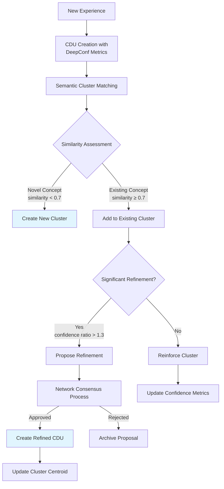

MemCDU: Context Data Unit Memory Architecture

Executive Summary

MemCDU is a content-addressable, confidence-aware memory system designed for intelligent agents operating in distributed environments. This architecture enables secure knowledge sharing, collaborative semantic refinement, and quality-guaranteed information exchange across multiple nodes while maintaining immutability and provenance tracking.

1 Core Architecture Principles

1.1 Foundational Concepts

* **Content-Addressable Storage:** Every CDU is identified by a cryptographic hash of its content, ensuring verifiability and deduplication
* **Immutability Guarantee:** CDUs are never modified; evolution occurs through new CDU creation with provenance links
* **Confidence-Aware Processing:** Deep Think with Confidence (DeepConf from Meta open source project) is a test-time method using model-internal confidence signals to filter out low-quality reasoning traces, enhancing both efficiency and accuracy—with no retraining required.
memCDU adapts DeepConf principles modularly:
  * Embeds local confidence metrics in each CDU.
  * Applies dynamic filtering: low-confidence CDUs are marked low_trust and excluded early.
  * Uses confidence-weighted merging during distributed consensus across cdqNetwork.
* **Distributed Semantics:** Semantic clustering enables collaborative knowledge refinement across nodes

1.2 Enhanced CDU Structure

```rust
#[derive(Serialize, Deserialize, Clone)]
pub struct Cdu {
    // Core Identity
    pub id: String,                       // SHA-256 content hash
    pub hlc: HybridLogicalClock,          // Causal timestamp
    pub type: CduType,                    // episodic, semantic, procedural, etc.
    
    // Content and Semantics
    pub content: String,
    pub embedding: Vector,                // model + float array
    pub agent_id: String,
    pub session_id: Option<String>,
    
    // Quality Metrics (DeepConf Integration)
    pub confidence_metrics: ConfidenceMetrics,
    pub quality_score: f32,
    
    // Distributed Operation
    pub provenance: ProvenanceData,       // Origin and exchange history
    pub network_metadata: NetworkMetadata, // Distribution information
    pub exchange_policy: ExchangePolicy,  // Sharing rules and permissions
    
    // Semantic Context
    pub semantic_cluster_id: Option<String>, // Linked semantic cluster
    pub refinement_level: u32,            // Version in refinement chain
}
```

2 WASI Architecture

2.1 Core Worlds

```wit
// Content-Addressable Storage
world cdu-store {
    export cdu-store: self.cdu-store
}

interface cdu-store {
    publish: func(new-cdu: cdu) -> future<expected<string, error>>;
    get: func(id: string) -> future<expected<cdu, error>>;
    query-by-vector: func(query: vector-query) -> future<expected<list<cdu>, error>>;
}

// Confidence Management (DeepConf Enhanced)
world confidence-manager {
    export confidence-manager: self.confidence-manager
}

interface confidence-manager {
    // DeepConf Core Functions
    evaluate-token-confidence: func(token-data: list<f32>) -> future<expected<f32, error>>;
    evaluate-group-confidence: func(tokens: list<token-data>, window-size: u32) 
        -> future<expected<f32, error>>;
    
    // Enhanced Entropy Functions
    calculate-semantic-entropy: func(embeddings: list<list<f32>>) 
        -> future<expected<f32, error>>;
    calculate-confidence-from-factors: func(factors: list<f32>, weights: list<f32>) 
        -> future<expected<f32, error>>;
    
    // Network-Aware Extensions
    calculate-network-confidence: func(cdu-id: string) 
        -> future<expected<f32, error>>;
    adjust-confidence-context: func(metrics: confidence-metrics, context: network-context) 
        -> future<expected<confidence-metrics, error>>;
}
```

2.2 Semantic Aggregation World

```wit
// Semantic Clustering and Refinement
world semantic-aggregation {
    export semantic-manager: self.semantic-manager
}

interface semantic-manager {
    // Cluster Management
    find-or-create-cluster: func(cdu: cdu) -> future<expected<string, error>>;
    get-semantic-cluster: func(semantic-id: string) -> future<expected<semantic-cluster, error>>;
    query-by-semantics: func(embedding: list<f32>, threshold: f32) 
        -> future<expected<list<semantic-cluster>, error>>;
    
    // Refinement Process
    propose-refinement: func(semantic-id: string, refined-embedding: list<f32>, 
        rationale: string) -> future<expected<refinement-result, error>>;
    vote-on-refinement: func(refinement-id: string, support-level: f32, 
        rationale: string) -> future<expected<bool, error>>;
    
    // Consensus Management
    calculate-consensus: func(semantic-id: string) 
        -> future<expected<consensus-result, error>>;
    flag-semantic-conflict: func(semantic-id: string, conflict-details: string) 
        -> future<expected<bool, error>>;
}
```

2.3 Network Exchange World

```wit
// Distributed Operations
world network-exchange {
    export exchange-manager: self.exchange-manager
}

interface exchange-manager {
    // CDU Exchange
    offer-cdu: func(cdu-id: string, target-node: string) -> future<expected<bool, error>>;
    request-cdu: func(cdu-id: string, source-node: string) -> future<expected<cdu, error>>;
    sync-node: func(node-id: string, since-hlc: hybrid-logical-clock) 
        -> future<expected<list<cdu>, error>>;
    
    // Network Management
    discover-similar: func(embedding: list<f32>, k: u32) -> future<expected<list<string>, error>>;
    get-node-capabilities: func(node-id: string) -> future<expected<node-capabilities, error>>;
    
    // Quality Control
    validate-received-cdu: func(cdu: cdu) -> future<expected<validation-result, error>>;
    report-quality-issue: func(cdu-id: string, reason: string) -> future<expected<bool, error>>;
}
```

3 Workflow Specifications

3.1 CDU Creation and Semantic Integration



3.2 Distributed Query Processing

```rust
impl SemanticManager {
    async fn distributed_query(&self, query: Query, context: QueryContext) 
        -> Result<Vec<Cdu>, Error> {
        // Phase 1: Local semantic search
        let local_results = self.query_by_semantics(query.embedding, 0.7).await?;
        
        // Phase 2: Network expansion if insufficient results
        if local_results.len() < context.min_results {
            let network_nodes = self.find_similar_nodes(query.embedding).await?;
            let network_results = self.retrieve_from_nodes(network_nodes, query).await?;
            results.extend(network_results);
        }
        
        // Phase 3: Confidence-based filtering and ranking
        let filtered = results.into_iter()
            .filter(|cdu| cdu.confidence_metrics.tail_confidence >= context.min_confidence)
            .sorted_by_confidence()
            .take(context.max_results);
        
        // Phase 4: Consistency validation
        if context.require_consistency {
            self.validate_consistency(&filtered, context.consistency_token).await?;
        }
        
        Ok(filtered)
    }
}
```

4 Semantic Refinement Process

4.1 Refinement Thresholds

Adaptive thresholds based on cluster maturity:

```rust
fn should_propose_refinement(cluster: &SemanticCluster, new_cdu: &Cdu) -> bool {
    let similarity = cosine_similarity(&cluster.canonical_embedding, &new_cdu.embedding);
    let confidence_ratio = new_cdu.confidence_metrics.tail_confidence / 
                         cluster.consensus_confidence;
    
    // Adaptive thresholds based on cluster maturity
    let age_factor = 1.0 - (cluster.member_cdus.len() as f32).min(100.0) / 100.0;
    
    // Younger clusters accept more refinements
    similarity < (0.7 + 0.2 * age_factor) || confidence_ratio > (1.5 - 0.5 * age_factor)
}
```

4.2 Consensus Formation

```rust
struct RefinementConsensus {
    pub approved: bool,
    pub confidence_boost: f32,           // Quality improvement
    pub new_embedding: Vector,           // Refined semantic representation
    pub supporting_nodes: Vec<String>,   // Nodes supporting refinement
    pub opposing_nodes: Vec<String>,     // Nodes opposing with reasons
    pub required_revisions: Vec<String>, // Suggested improvements
}

impl SemanticManager {
    async fn evaluate_refinement(&self, proposal: RefinementProposal) 
        -> Result<RefinementConsensus, Error> {
        // Collect weighted votes based on node reputation and expertise
        let votes = self.collect_network_votes(&proposal).await?;
        
        // Calculate weighted consensus considering:
        let consensus_score = self.calculate_weighted_consensus(&votes).await?;
        
        // Apply quality validation checks
        let quality_approved = self.validate_refinement_quality(&proposal).await?;
        
        // Check for semantic coherence
        let semantic_coherence = self.assess_semantic_coherence(&proposal).await?;
        
        Ok(RefinementConsensus {
            approved: consensus_score > 0.7 && quality_approved && semantic_coherence > 0.6,
            confidence_boost: calculate_improvement_metric(&proposal),
            new_embedding: proposal.refined_embedding,
            supporting_nodes: votes.supporting_nodes(),
            opposing_nodes: votes.opposing_nodes(),
            required_revisions: extract_revision_suggestions(&votes),
        })
    }
}
```

5 Use Case Implementations

5.1 Scientific Research Assistant

```rust
impl ResearchAssistant {
    async fn evaluate_hypothesis(&self, hypothesis: &str, domain: &str) 
        -> Result<ResearchEvaluation, Error> {
        // Create hypothesis CDU
        let hypothesis_cdu = self.create_cdu(hypothesis, domain).await?;
        
        // Retrieve relevant knowledge with high confidence requirements
        let context = QueryContext {
            min_confidence: 0.8,         // Require high-confidence evidence
            max_results: 20,
            require_consistency: true,
        };
        
        let evidence = self.semantic_manager.distributed_query(
            hypothesis_cdu.embedding.clone(), 
            context
        ).await?;
        
        // Evaluate hypothesis against evidence
        let confidence = self.calculate_hypothesis_confidence(&hypothesis_cdu, &evidence).await?;
        
        Ok(ResearchEvaluation {
            hypothesis: hypothesis_cdu.id,
            confidence_score: confidence,
            supporting_evidence: evidence.iter().filter(|e| e.confidence_impact > 0).collect(),
            conflicting_evidence: evidence.iter().filter(|e| e.confidence_impact < 0).collect(),
            semantic_clusters: self.identify_relevant_clusters(&evidence).await?,
            recommended_actions: self.generate_recommendations(confidence, &evidence).await?,
        })
    }
}
```

5.2 Multi-Agent Collaboration System

```rust
impl CollaborationOrchestrator {
    async fn resolve_knowledge_dispute(&self, conflicting_cdu_ids: Vec<String>) 
        -> Result<ConflictResolution, Error> {
        // Retrieve conflicting CDUs
        let conflicting_cdus = self.retrieve_cdus(conflicting_cdu_ids).await?;
        
        // Analyze semantic context for each
        let semantic_contexts = self.analyze_semantic_contexts(&conflicting_cdus).await?;
        
        // Find common ground and differences
        let common_ground = self.find_common_semantic_elements(&semantic_contexts).await?;
        let differences = self.identify_semantic_differences(&semantic_contexts).await?;
        
        // Initiate resolution process
        let resolution = if differences.is_empty() {
            // Surface conflict only - create reconciled CDU
            self.create_reconciled_cdu(common_ground).await?
        } else {
            // Semantic conflict - initiate refinement process
            self.propose_semantic_refinement(common_ground, differences).await?
        };
        
        Ok(ConflictResolution {
            resolution_type: if differences.is_empty() { "Reconciliation" } else { "Refinement" },
            resolved_cdu_id: resolution.cdu_id,
            confidence: resolution.confidence,
            supporting_nodes: resolution.supporting_nodes,
            resolution_process: resolution.process_history,
            remaining_issues: resolution.remaining_issues,
        })
    }
}
```

6 Performance and Scaling

6.1 Governance and Limits

```rust
struct PerformanceGovernor {
    // Cluster Management Limits
    max_cluster_size: usize,              // Default: 1000 CDUs
    max_clusters_per_domain: usize,       // Default: 10,000
    min_refinement_interval: Duration,    // Default: 5 minutes
    
    // Query Complexity Limits
    max_query_complexity: usize,          // Default: 1000 operations
    query_timeout: Duration,              // Default: 30 seconds
    
    // Network Operation Limits
    max_concurrent_exchanges: usize,      // Default: 100
    exchange_bandwidth_limit: DataRate,   // Default: 100 Mbps
}

impl PerformanceGovernor {
    async fn enforce_operational_limits(&self, operation: OperationType) -> Result<(), Error> {
        match operation {
            OperationType::ClusterCreation => {
                if self.current_cluster_count() > self.max_clusters_per_domain {
                    return Err(Error::ResourceExhausted("Too many clusters"));
                }
            }
            OperationType::RefinementProposal => {
                if self.recent_refinement_count() > self.refinement_rate_limit() {
                    return Err(Error::RateLimited("Too many refinements"));
                }
            }
            // Additional operation types
        }
        Ok(())
    }
}
```

6.2 Monitoring and Metrics

Key performance indicators to monitor:

· Cluster Health: Size distribution, growth rates, refinement frequency
· Query Performance: Latency percentiles, cache hit rates, complexity distribution
· Network Efficiency: Exchange success rates, bandwidth utilization, latency
· Quality Metrics: Confidence stability, refinement success rates, conflict resolution time

7 Security and Trust Model

7.1 Enhanced Trust Management

```rust
struct TrustManager {
    node_reputation: HashMap<String, NodeReputation>,
    decay_function: TrustDecayFunction,
    minimum_trust_threshold: f32,
}

impl TrustManager {
    fn calculate_current_trust(&self, node_id: &str) -> f32 {
        let reputation = self.node_reputation.get(node_id).unwrap_or_default();
        let time_decay = self.calculate_time_decay(reputation.last_activity);
        reputation.trust_score * time_decay
    }
    
    fn calculate_time_decay(&self, last_activity: HybridLogicalClock) -> f32 {
        let hours_inactive = hours_since(last_activity);
        // Exponential decay: halve trust every 30 days of inactivity
        f32::exp2(-hours_inactive / (30.0 * 24.0))
    }
    
    async fn update_trust_based_on_contribution(&self, node_id: &str, 
                                              contribution_quality: f32) {
        let current_trust = self.calculate_current_trust(node_id);
        let new_trust = current_trust * 0.9 + contribution_quality * 0.1;
        self.update_node_trust(node_id, new_trust).await;
    }
}
```

8 Implementation Roadmap

8.1 Phase 1: Core Infrastructure

· Implement enhanced CDU structure with provenance tracking
· Build semantic clustering engine with adaptive thresholds
· Develop basic network exchange protocol

8.2 Phase 2: Quality and Refinement

· Implement DeepConf integration with network-aware confidence
· Build refinement proposal and consensus system
· Develop conflict detection and resolution mechanisms

8.3 Phase 3: Distributed Optimization

· Implement performance governance and rate limiting
· Build trust management and reputation system
· Develop advanced caching and prefetching strategies

8.4 Phase 4: Production Readiness

· Comprehensive testing and validation
· Performance tuning and optimization
· Security auditing and hardening

9 Conclusion

This enhanced memCDU architecture provides a comprehensive solution for distributed knowledge management with quality guarantees. The integration of semantic clustering, collaborative refinement, and network-aware confidence metrics enables intelligent agents to build and maintain high-quality knowledge bases through distributed collaboration.

The architecture maintains strong consistency across all components while providing the flexibility needed for diverse applications. The performance governance and security models ensure reliable operation even at scale, making memCDU suitable for production deployment in demanding environments.
