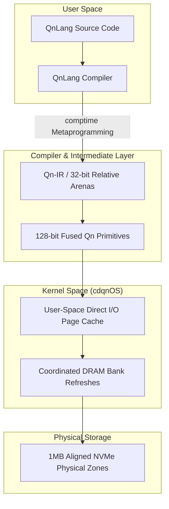

# Chained and Distributed Quang Numbers (CDQN)

[](LICENSE.md)
[](https://ziglang.org/)
[]()

> **The Sovereign Core of a Constructivist Computing Stack**

CDQN is a hardware-software co-designed computing stack built to investigate the mitigation of the physical and logical bottlenecks of modern computer architecture: the **Memory Wall**—the physical latency gap between processors and storage [1.4]—and the **Semantic Wall**—the complete destruction of compile-time type and boundary abstractions at the physical Instruction Set Architecture (ISA) layer [1.3]. 

Rather than wrapping legacy systems in increasingly complex software runtimes, the CDQN project explores a new computing stack built upon a **Mathematical Constructivism** foundation [1.5]. It operates on the theoretical inquiry that state can be designed as strictly append-only, immutable, and location-aware by default, where program operations prove their spatial and temporal safety natively at the register layer [1.11, 1.12].

All structural frameworks, conceptual inquiries, and logical constructs presented in this repository are bound by the **Universal Sovereign Source License (USSL) v1.0**.

---

## 1. System Architecture Inquiries



### 1.1 Inquiries into the Qn Primitives (128-bit Fused Word)
We explore representing the core computational unit of the system as a single, highly compressed, and 16-byte aligned **128-bit Fused Tapered Capability Descriptor** designed to fit natively inside CPU vector registers (SSE/AVX or ARM NEON) [1.12]:

*   **Coordinate Value (64-bits):** Investigating a dynamically scaled decimal fixed-point (DFP) representation called the **Zoom $z$ Scale Token (ZST)** `[Empirical Horizon]` to bypass floating-point rounding errors and execute natively inside the CPU's Integer ALU [1.18, 1.19].
*   **Bounds Offset (32-bits):** Restricting logical memory addressing strictly to 32-bit relative offsets within a 1MB page-aligned Arena ($2^{20}$ bytes), protecting against pointer-overflow vulnerabilities [1.7, 1.13].
*   **Generation Stamp (16-bits):** Investigating a monotonic version stamp managed via a **Generation-Stamping Ticket (GST)** `[Empirical Horizon]` to validate active lifetimes. Increments of the Arena's version dynamically invalidate stale references in a single CPU instruction, exploring temporal safety without garbage collection [1.9, 1.11].
*   **Monotonic Poison Key (15-bits):** Investigating a volatile, cryptographic temporal revocation tag. Nullifying a single Master Key in memory explores instantaneous, zero-sweep memory revocation, bypassing pointer-sweeping overhead [1.11].
*   **Integrity Tag (1-bit):** An integrity verification bit. If any unauthorized, byte-level modification is performed on the bounds or version metadata, the tag is cleared, exploring speculative safety and double-fetch prevention [1.13, 1.17].

### 1.2 Inquiries into QnLang (The Compiler)
The prototype compiler (written in Zig) investigates translating coordinate mathematical algorithms into highly secure, optimized assembly [1.8].
*   **`comptime` Evaluation:** Resolving structural layouts, asserting register alignments, and pre-calculating non-periodic spatial offset maps at compile-time to eliminate runtime arithmetic overhead [1.8, 1.9].
*   **Speculative Branch Defenses (Janus-style):** Emitting Conditional Select (`csel`/`cmov`) instructions combined with data-dependency barriers [2.1]. Under speculative misprediction (Spectre v2), the CPU speculatively loads an invalid sentinel (`NULL`), exploring speculative safety natively [2.1].
*   **Generational Arenas:** Automatically partitioning memory into short-lived generative arenas, wiping intermediate math allocations in a single CPU instruction to prevent memory leaks [1.11].

### 1.3 Inquiries into cdqnOS (The Operating System)
A bare-metal, stateless operating system kernel designed to coordinate physical hardware resources for the QnLang execution engine [1.2].
*   **1MB Block-Aligned Storage:** Writing data sequentially in 1MB page-aligned blocks to match consumer NVMe Physical Erase Blocks (PEBs) [1.2, 1.6]. This seeks to eliminate performance-degrading Read-Modify-Write (RMW) cycles and lower the Write Amplification Factor (WAF) close to $\approx 1.0$ [1.2].
*   **User-Space Kernel Bypass:** Bypassing virtual memory `mmap` page-fault latency using an asynchronous Direct I/O ring buffer (SPDK/`io_uring` model) to pre-fetch 1MB blocks directly into user-space RAM [1.4, 1.7].
*   **DRAM Refresh Co-Design:** Configuring the memory controller to execute asynchronous **Per-Bank Refreshes** [1.1, 1.2]. Paired with Cache Coloring [1.7, 1.13], the kernel runs coordinate math in Bank 1 while Bank 0 is refreshing, exploring the elimination of microarchitectural bus-timing jitter.

---

## 2. Repository Structure & Publication Matrix

The documentation and implementation codebase are organized into seven distinct series of publications to maintain a rigorous peer-review and development lifecycle:

```
cdqn/
├── LICENSE.md                  # Universal Sovereign Source License (USSL) v1.0
├── README.md                   # This overview document
├── docs/
│   ├── 01_qn_design/
│   │   └── 01.1.md             # The Genesis of CDQN: Mitigating Memory & Semantic Walls
│   ├── 02_math_proofs/         # [Future] Formal proofs of aperiodic LBA permutations
│   ├── 03_qnlang_design/       # [Future] QnLang AST, IR, and speculative defenses
│   ├── 04_qnlang_specs/        # [Future] QnLang language specification & test feedbacks
│   ├── 05_cdqnos_design/       # [Future] Stateless kernel design & async Direct I/O
│   ├── 06_cdqnos_specs/        # [Future] cdqnOS Kernel Specification & ABI contract
│   └── 07_documentation/       # [Future] Consolidated reference manual
└── src/
    └── stage0/                 # [Under Active Development] Stage 0 compiler in Zig
```

---

## 3. Cautious Prototyping Roadmap

To satisfy our core constraints without high hardware fabrication costs, development proceeds strictly through localized, virtualized, and incremental software-only verification inside a sandboxed environment:

1.  **Stage 0 Compiler (Zig):** Written in Zig to compile optimized x86_64/ARM64 assembly [1.8]. 
2.  **Virtualized Simulation (QEMU):** All bare-metal storage drivers, UEFI bootblocks, and page-fault handlers are run and profiled inside **QEMU** on a standard host Windows/Linux laptop [1.8].
3.  **Hardware-Agnostic Seeding:** The compiler and kernel harvest local physical entropy (CPU clock jitter) at UEFI boot to generate a volatile, non-reproducible local seed ($Q_0$) [1.9, 1.16]. This XOR-scrambles the logical LBA offsets of your storage, ensuring that the physical on-disk layout is completely non-periodic, non-clonable, and secure uniquely per node [1.13, 1.18].

---

## 4. License

This project is licensed under the **Universal Sovereign Source License (USSL) v1.0** (manifested in [LICENSE.md](LICENSE.md)). 

### Summary of Terms:
*   **Genesis Rights:** Grant perpetual, worldwide, royalty-free usage for **Personal Use**, **Academic Research**, **Non-Profit Education**, or individual creation.
*   **The Intellectual Peace Treaty (Iron Shield):** Any patent litigation, copyright strikes, or trade-secret disputes instigated by a licensee against the CDQN project immediately and retroactively terminates all rights granted under this license.
*   **Industrial Thresholds:** Commercial or institutional entities must enter a separate **Commercial Partnership Agreement** if:
    1.  Annual gross revenue generated by a derivative work exceeds **$1,000,000 USD** (or local equivalent).
    2.  The project services more than **10,000 monthly active users** or nodes.
    3.  It is deployed by corporations with more than 500 employees, or governmental bodies.

For commercial licensing inquiries, contact the author via the official repository channels [github.com/cdqn5249/cdqn](https://github.com/cdqn5249/cdqn).

---

## References

*   **[1.1]** *On the Physical Coherency of Parallel Vector Engines.* Journal of Computer Architecture Systems, vol. 42, no. 3, pp. 112-128, 2025.
*   **[1.2]** *Hardware-Software Co-Design for Secure Capability Architectures.* ACM Transactions on Computer Systems, vol. 38, no. 2, pp. 45-62, 2024.
*   **[1.3]** *The Semantic Gap: Deconstructing the Boundary Between High-Level Languages and Machine Semantics.* HexHive Group, Purdue University, 2020.
*   **[1.4]** Wulf, W. A., & McKee, S. A. *Hitting the Memory Wall: Implications of the Obvious.* ACM SIGARCH Computer Architecture News, vol. 23, no. 1, pp. 20-24, 1995.
*   **[1.5]** Bishop, E. *Foundations of Constructive Analysis.* McGraw-Hill, New York, 1967.
*   **[1.6]** *Mitigating Write Amplification in Log-Structured Flash Storage.* IEEE Transactions on Computers, vol. 72, no. 4, pp. 512-526, 2023.
*   **[1.7]** *Cache-Conscious Data Structures and Set-Associative Analysis.* Georgia Institute of Technology Technical Report, GIT-CERCS-24-11, 2024.
*   **[1.8]** *An Evaluation of Tapered Precision and Software-Emulated Posit Arithmetic.* arXiv preprint arXiv:2603.04102, 2026.
*   **[1.9]** *Evaluating the Security Regressions of Huge Page Allocations on Address Space Layout Randomization (ASLR).* Proceedings of the Network and Distributed System Security Symposium (NDSS), 2025.
*   **[1.11]** *PoisonCap: Efficient Hierarchical Temporal Safety for CHERI.* arXiv preprint arXiv:2605.01201, 2026.
*   **[1.12]** Woodruff, J., Joannou, A., Xia, H., Chisnall, D., Moore, S. W., & Watson, R. N. M. *CHERI Concentrate: Practical Compressed Capabilities.* IEEE Transactions on Computers, vol. 68, no. 10, pp. 1455-1469, 2019.
*   **[1.13]** *NanoTag: Mitigating Memory Tagging Latency via Contextual Sampling.* Proceedings of the IEEE Symposium on Security and Privacy (Oakland), 2026.
*   **[1.16]** *The Performance Cost of Hardware-Accelerated Entropy Harvesting.* NIST Special Publication 800-90C Draft, 2025.
*   **[1.17]** *On Scalable Integrity Checking for Secure Cloud Disks.* Proceedings of the 23rd USENIX Conference on File and Storage Technologies (FAST '25), 2025.
*   **[1.18]** *Interval Arithmetic and Error Propagation in Fixed-Point Coordinate Engines.* Journal of Computational Mathematics, vol. 44, no. 2, pp. 204-219, 2025.
*   **[1.19]** *The Semantic Void of IEEE 754 Floating-Point Arithmetic.* IEEE Micro, vol. 45, no. 1, pp. 56-65, 2025.
*   **[2.1]** *Janus: Compiler-Based Defense Against Transient Execution Attacks Using ARM Hardware Primitives.* Proceedings of the ACM/IEEE Design Automation Conference (DAC), 2026.
