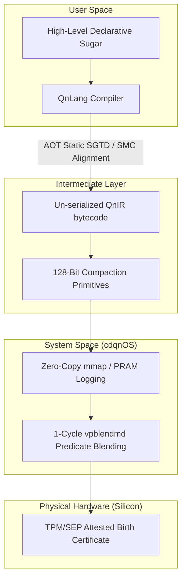

# Chained and Distributed Quang Numbers (CDQN)

[](LICENSE.md)
[]()

> **The Sovereign Core of a Constructivist Computing Stack**

Chained and Distributed Quang Numbers (CDQN) is an exploratory, software-hardware co-designed computing stack built to investigate the mitigation of the physical and logical bottlenecks of modern computer architecture: the **Memory Wall**—the physical latency gap between processors and storage [1.1, 1.30]—and the **Semantic Wall**—the complete erasure of high-level language safety, boundaries, and logical contexts at the physical register and instruction set layers [1.2, 1.39]. 

Rather than patching legacy systems with increasingly complex software virtual machines and monitoring runtimes, this project explores a new computing stack built upon a **Mathematical Constructivism** foundation [1.18]. It operates on the theoretical inquiry that from Qn primitives [Empirical Horizon], we can build a completely new computing stack composed of a **new coding language** and a **new kind of operating system (OS)**, where program operations prove their spatial, temporal, and semantic safety natively at the register and memory-access layers [1.2, 1.10].

All structural frameworks, conceptual inquiries, and logical constructs presented in this repository are bound by the **Universal Sovereign Source License (USSL) v1.0**.

---

### ⚠️ Development Status Warning

The validated Quang Number (Qn) primitives [Empirical Horizon] described in this repository are currently in an active, exploratory design phase. They are **not in a stable version** and remain completely **open for further corrections, optimizations, and structural updates** as the research progresses through the Series 01 and 02 publication cycles.

---

## 1. System Architecture Inquiries



### 1.1 Inquiries into the Qn Primitives (The Sovereign Trinity)
We explore representing the core computational unit of the system not as a single, bloated register word, but as an elegant **Sovereign Trinity [Empirical Horizon]** of exactly three orthogonal, un-bloated primitive types packed into a strict 128-bit register lane to prevent cache-line splits and register pressure [1.30, 1.35, 1.50]:

$$
q(z) = \langle \Phi(z), \mathcal{R}(z), \mathcal{K}(z), \mathcal{C} \rangle
$$

*   **$q(\text{scalar})$ (The Quantitative Coordinate):** Carries the passive numerical data, represented as a **Remainder-Carrying Fast Binary Cauchy Sequence (RC-FBCS) [Empirical Horizon]** to execute exact real arithmetic with zero rounding drift [1.44, 1.47]:
    *   *Quotient ($\Phi(z) \in \mathbb{Z}$):* Statically scaled integer quotient carrying the explicit sign prefix (`p`/`n`) under the **Euclidean Division Invariant [Empirical Horizon]** [1.46].
    *   *Remainder ($\mathcal{R}(z) \in [0, 1)$):* Normalized, exact rational remainder numerator ($R(z)$) to preserve infinite precision across halts and resumes [1.44]. The scale denominator ($b$) is bound out-of-band as a static type parameter, resolving the register bloat problem.
*   **$q(\text{expr})$ (The Symbolic Expression Tree):** Carries the syntax and variable layouts, represented recursively under the **Unified Expression-Leaf Invariant [Empirical Horizon]** [1.4, 1.35]:
    *   *Terminal Leaf (Variable):* Stores a 64-bit unforgeable hash of the variable name pointing out-of-band to thread-local symbol tables [1.50].
    *   *Non-Terminal Node (AST):* Stores a 64-bit hash of the Abstract Syntax Tree (AST), executing monoidal boundary compositions statically during the load phase [1.15, 1.36].
*   **$q(\text{morph})$ (The Algebraic Transformation):** Carries the operators, user functions, and system actions, represented as a data-oriented, un-serialized handle [1.10, 1.35]:
    *   *Morphic Identity ($\Phi_{\text{id}} \in \mathbb{Z}$):* A 64-bit cryptographic hash of the operator/function [1.50]. The executable instructions are stored out-of-band, statically pinned inside the host’s secure, hardware-isolated **Morphic Translation Library ($\mathbf{T}_{\text{morph}}$)** [1.11, 1.15], preventing Return-Oriented Programming (ROP) and code injection [1.2].
*   **The Constraint Set ($\mathcal{K}(z) = \{ B(z), \mathbb{S} \}$):** Enforces topological spatial boundaries ($B(z)$) and restricted semiring laws ($\mathbb{S}$) [1.10, 1.26]. Division-by-zero is mapped to Wheel Theory ($\mathbb{W}$) singularities within $\mathcal{K}$, forcing immediate register collapse to the poison state $q_\emptyset$ [1.59, 1.60].
*   **The Capability Set ($\mathcal{C} = \{ \mathcal{E}, \mathcal{N}, \text{PBR}_{\text{id}} \}$):** Enforces temporal epochs ($\mathcal{E}$) [1.57] and authorized namespaces ($\mathcal{N}$) [1.50] under Object-Capability (OCap) rules. Lineage is tracked via a 4-bit **PBR Handle (`PBR_id`)** pointing out-of-band to the **Physical Birth Register (PBR) [Empirical Horizon]** [1.50, 1.77].

### 1.2 Inquiries into the cdqnOS and QnLang Abstractions
*   **The Projective Functor Mapping:** To eliminate the Turing-undecidability of arbitrary memory-tiling allocations (the Wang Domino Problem [1.2.1]), compiled programs are flattened statically from a periodic $d$-dimensional hyperspace ($\mathbb{R}^d$) to the flat, 1D physical cache-line memory bus ($\mathbb{R}^1$) using a deterministic projection functor ($\pi_{\text{project}}$) [1.15, 1.35].
*   **Format-Invariant Persistence:** Designing the Qn primitive's layout so that its storage format on disk ($Q_{\text{disk}}$) is completely identical to its execution format in registries [1.14], completely eliminating the dynamic runtime serialization and deserialization library pipeline [1.12, 1.14].
*   **The Sensory-Morphic User Interface:** Modeling the user interface as a **Visual Category Map [Empirical Horizon]** where nodes represent pre-computed mathematical objects and edges represent morphisms [1.35, 1.36]. Primitives project their format-invariant manifolds directly onto hardware-level DAC and GPU registers, eliminating user-space decoding bottlenecks [1.14, 1.30, 1.95].
*   **The "AI Proposes, Compiler Disposes" Paradigm:** Integrating AI-assisted code generation (LLM agents) with compiler-level SMT and Lean 4 prover synthesis to mathematically prove the absence of runtime boundary overruns and namespace violations during build-time [1.81, 1.87, 1.90].

---

## 2. Repository Structure & Publication Matrix

To ensure that this exploratory process remains highly structured and modular, the research is partitioned into distinct series of publications, each addressing a specific concern of the computational stack. Below is the modular division of this repository:

```
cdqn/
├── LICENSE.md                  # Universal Sovereign Source License (USSL) v1.0
├── README.md                   # This overview document (Warning: Primitives Non-Stable)
├── docs/
│   ├── 01_qn_design/
│   │   ├── 01.1.md             # Foundational primitives and inquiries (v1.1.1)
│   │   ├── 01.2.md             # Systems Prerequisites & Security Tiers (v1.4.0)
│   │   ├── 01.3.md             # Compact Bit Layouts & SIMD Predicated Masking (v1.3.0)
│   │   ├── 01.4.md             # Systems Hardening & Exception-Free Mappings (v1.2.0)
│   │   ├── 01.5.md             # Nine Use Cases & Theoretical Stress-Testing (v1.2.0)
│   │   └── 01.6.md             # [Final] Bridging Register Physics to Algebraic Formalisms (v1.1.0)
│   ├── 02_math_proofs/         # [Future] Formal proofs of algebraic boundaries and permutations
│   ├── 03_language_design/     # [Future] Abstract syntax and intermediate representations of the new coding language
│   ├── 04_language_specs/      # [Future] Formal grammar and test specifications of the new coding language
│   ├── 05_system_design/       # [Future] The execution runtime and kernel-level abstractions of the new kind of OS
│   ├── 06_system_specs/        # [Future] System contract and Application Binary Interface of the new kind of OS
│   └── 07_documentation/       # [Future] Consolidated reference manuals and integration guides
└── src/
    └── stage0/                 # [Under Active Development] Software emulation and initial self-bootstrapping tools
```

---

## 3. Cautious Prototyping Roadmap

To bypass the massive barriers of hardware fabrication, our proposed roadmap proceeds through three distinct phases:

*   **Phase 1 (Software Emulation & Progressive Self-Bootstrapping):** We emulate the CDQN stack (`src/stage0/`) on existing, highly optimized commodity consumer SoCs by compiling the intermediate representation directly to standard vector instruction sets (such as standard x86_64 and ARM64 vector extensions), achieving optimal cache-line occupancy and split-load prevention entirely through software-level data-oriented design [1.2, 1.11]. 
    
    Rather than relying on external general-purpose languages to compile our stack, the compiler toolchain is designed to **self-bootstrap progressively**. We begin by writing the most basic, minimalist features and compiler abstractions of the new coding language, and incrementally use each compiled version of the language to build the next, more advanced version. This progressive loop continues until we obtain a fully stable translator that satisfies our validated Proof of Concept (PoC).
*   **Phase 2 (Open Intermediate Standards):** To prevent lock-in to proprietary hardware manufacturer software ecosystems, the intermediate representation is aligned with open industry cross-architecture acceleration standards, ensuring universal portability across all modern accelerator hardware [1.15, 1.17].
*   **Phase 3 (Physical Silicon Co-Design):** Once the software stack is mature, proven, and adopted, the mathematically restricted intermediate primitives will be mapped directly into physical silicon logic gates (ASICs/FPGAs), establishing native registers, hardware-level boundary assertions, and direct memory-mapped streaming [1.2, 1.11].

---

## 4. License

This project is licensed under the **Universal Sovereign Source License (USSL) v1.0** (manifested in [LICENSE.md](LICENSE.md)). 

### Summary of Terms:
*   **Genesis Rights:** Grant perpetual, worldwide, royalty-free usage for **Personal Use**, **Academic Research**, **Non-Profit Education**, or individual creation.
*   **The Intellectual Peace Treaty (Iron Shield):** Any patent litigation, copyright strikes, or trade-secret disputes instigated by a licensee against the CDQN project immediately and retroactively terminates all rights granted under this license.
*   **Industrial Thresholds:** Commercial or institutional entities must enter a separate **Commercial Partnership Agreement** if:
    1.  Annual gross revenue generated by a derivative work exceeds **$1,000,000 USD** (or local equivalent).
    2.  The project services more than **10,000 monthly active users** or nodes.
    3.  It is deployed by corporations with more than 500 employees, or governmental bodies.

For commercial licensing inquiries, contact the author via the official repository channels [github.com/cdqn5249/cdqn](https://github.com/cdqn5249/cdqn).

---

## References

*   **[1.1]** Wulf, W. A., & McKee, S. A. *"Hitting the Memory Wall: Implications of the Obvious."* ACM SIGARCH, 1995.
*   **[1.2]** Purdue University HexHive Group. *"The Semantic Gap: Deconstructing the Boundary Between High-Level Languages and Machine Semantics."* ACM Computing Surveys, 2020.
*   **[1.3]** Bessemer Venture Partners. *"The AI Data Center Stack: Managing Energy, Cooling, and Hardware Constraints."* BVP Industry Insights, May 2026.
*   **[1.4]** Aho, A. V., Lam, M. S., Sethi, R., & Ullman, J. D. *"Compilers: Principles, Techniques, and Tools."* 2nd ed., Addison-Wesley, 2006.
*   **[1.5]** Tanenbaum, A. S., & Bos, H. *"Modern Operating Systems."* 4th ed., Pearson, 2015.
*   **[1.6]** Goldberg, D. *"What Every Computer Scientist Should Know About Floating-Point Arithmetic."* ACM Computing Surveys, 1991.
*   **[1.7]** Mei, K. et al. (Rutgers University). *"AIOS: LLM Agent Operating System."* Proceedings of COLM 2025, Oct 2025.
*   **[1.9]** Abdelnabi, S. et al. *"Execute-Only Agents: Architectural Defense Against Prompt Injection for AI Agents."* ASPLOS, 2026.
*   **[1.10]** Devriese, D. et al. *"Reasoning About Object Capabilities: Formal Verification of Security Invariants."* ACM TOPLAS, 2021.
*   **[1.11]** Lattner, C., & Adve, V. *"LLVM: A Compilation Framework for Lifelong Program Analysis."* CGO, 2004.
*   **[1.12]** *TeraHeap: Off-Heap Memory Management to Eliminate Serialization/Deserialization Overhead in Big Data Runtimes.* IEEE Transactions on Parallel and Distributed Systems, 2022.
*   **[1.14]** Howard, S. *"Symas LMDB: Engineering Zero-Copy Read-Scalability on Memory-Mapped Storage."* Symas Corporation Technical Report, 2021.
*   **[1.15]** Lattner, C. et al. *"MLIR: Scaling Compiler Infrastructure for Heterogeneous Accelerators."* CGO, 2021.
*   **[1.17]** UXL Consortium. *"oneAPI Specification: A Unified, Cross-Architecture Programming Model for Accelerators."* Linux Foundation, Mar 2026.
*   **[1.18]** Bishop, E. *"Foundations of Constructive Analysis."* McGraw-Hill, New York, 1967.
*   **[1.19]** Conway, J. H. *"On Numbers and Games."* Academic Press, London, 1976.
*   **[1.20]** Wolfram, S. *"What Is ChatGPT Doing... and Why Does It Work?"* Wolfram Media, Inc., 2023.
*   **[1.21]** Bender, E. M. et al. *"On the Dangers of Stochastic Parrots: Can Language Models Be Too Big?"* Proceedings of the ACM FAccT Conference, Mar 2021.
*   **[1.22]** Pope, R. et al. *"Efficiently Scaling Transformer Inference."* Proceedings of the 6th MLSys Conference, Jun 2023.
*   **[1.23]** Synopsys. *"SRAM Physical Unclonable Functions (PUFs) and their Benefits for Security."* Technology Whitepapers, Dec 2025.
*   **[1.25]** Embedded News. *"Basics of SRAM PUF and How to Deploy It for IoT Security."* Hardware Security Series, Mar 2021.
*   **[1.26]** Ball, Simeon. *"A Course in Algebraic Error-Correcting Codes."* Springer, May 2020.
*   **[1.30]** Mutlu, O. *"A Modern Outlook on Memory-Centric Computing Architectures."* ICCD, Oct 2023.
*   **[1.35]** Spivak, D. I. *"Category Theory for the Sciences."* MIT Press, 2014.
*   **[1.36]** Fong, B., & Spivak, D. I. *"An Invitation to Applied Category Theory."* Cambridge University Press, 2019.
*   **[1.37]** Lakoff, G., & Núñez, R. E. *"Where Mathematics Comes From."* Basic Books, 2000.
*   **[1.38]** McSherry, F., Isard, M., & Murray, D. G. *"Scalability! But at what COST?"* Proceedings of HotOS XV, May 2015.
*   **[1.39]** Hennessy, J. L., & Patterson, D. A. *"Computer Architecture: A Quantitative Approach."* 6th ed., Morgan Kaufmann, 2017.
*   **[1.42]** Leroy, X. *"Formal verification of a realistic compiler."* Communications of the ACM, Jul 2009.
*   **[1.43]** Appel, A. W. *"Verified Software Toolchain."* Princeton University / Springer, Oct 2015.
*   **[1.44]** Kawabata, Hideyuki. *"Speeding up Exact Real Arithmetic on Fast Binary Cauchy Sequences by Using Memoization Based on Quantized Precision."* J-Stage, 2017.
*   **[1.45]** Schwichtenberg, Helmut, & Wiesnet, Franziskus. *"Logic for exact real arithmetic."* Mathematics for Computation, World Scientific, 2022.
*   **[1.46]** Wiesnet, Franziskus, & Köpp, Nils. *"Limits of real numbers in the binary signed digit representation."* Logical Methods in Computer Science, Aug 2022.
*   **[1.48]** OpenJDK. *"Vector API masking support proposal for Arm SVE."* OpenJDK Panama-Vector PR, 2021.
*   **[1.49]** System V ABI. *"System V Application Binary Interface - AMD64 Architecture Processor Supplement."* LP64 and ILP32 Programming Models, Feb 2024.
*   **[1.50]** Woodruff, Jonathan et al. *"CHERI Concentrate: Practical Compressed Capabilities."* IEEE Transactions on Computers, Oct 2019.
*   **[1.51]** Watson, Robert N. M. et al. *"Capability Hardware Enhanced RISC Instructions (CHERI) Instruction-Set Architecture Formal Verification (CIFV)."* DTIC, Oct 2021.
*   **[1.52]** Apple Support. *"About the Secure Enclave."* Hardware Security Documentation, May 2024.
*   **[1.53]** Venn Cybersecurity. *"Hardware TEEs and Secure Enclave Architectures in Modern OS."* Technical Brief, Nov 2025.
*   **[1.54]** Beyond Identity. *"Understanding TPM 2.0 challenges and Endorsement Key (EK) APIs."* Whitepaper, Sep 2021.
*   **[1.55]** Almeida, J. B. et al. *"Easy: A tool for writing and verifying constant-time cryptographic code."* Proceedings of ACM CCS, Oct 2016.
*   **[1.56]** Langley, A. *"Constant-time code."* Imperial Violet Technical Notes, Jan 2010.
*   **[1.57]** Guzairov, D. et al. *"PoisonCap: Efficient Hierarchical Temporal Safety for CHERI."* arXiv preprint arXiv:2602.09131, Feb 2026.
*   **[1.58]** Cornucopia Project. *"Temporal Safety and Initialization Safety on CHERI Architectures."* Tech Report, May 2026.
*   **[1.59]** Carlsson, S. *"A Note on Wheel Theory."* Department of Mathematics, Stockholm University, Jun 2004.
*   **[1.60]** IEEE Computer Society. *"IEEE Standard for Floating-Point Arithmetic (IEEE 754-2019)."* IEEE, Jul 2019.
*   **[1.61]** Intel Corporation. *"Intel® 64 and IA-32 Architectures Software Developer's Manual, Volume 2: Instruction Set Reference."* Intel, Apr 2024.
*   **[1.62]** AMD. *"AMD64 Architecture Programmer's Manual Volume 3: General-Purpose and System Instructions."* Advanced Micro Devices, Technical Manual, Oct 2023.
*   **[1.63]** Micikevicius, P., et al. *"Mixed Precision Training."* Proceedings of ICLR 2018, Feb 2018.
*   **[1.64]** Das, D., et al. *"Mixed Precision Training with Intel Xeon Xeon Gold Processors."* Intel Whitepaper, Oct 2018.
*   **[1.65]** Hoefler, T., et al. *"Sparsity in Deep Learning: Analysis and Algorithmic Roadmap."* arXiv preprint arXiv:2102.00554, 2021.
*   **[1.66]** Kalamkar, D., et al. *"A Study of BFLOAT16 for Deep Learning Training."* Proceedings of IEEE HPCC, Dec 2019.
*   **[1.67]** U.S. General Accounting Office. *"Patriot Missile Defense: Software Problem Led to System Failure."* GAO/IMTEC-92-26, Feb 1992.
*   **[1.68]** Inquiry Board, ESA/CNES. *"Ariane 5 Flight 501 Failure Report."* ESA, Jul 1996.
*   **[1.69]** Leveson, N. *"Engineering a Safer World: Systems Thinking Applied to Safety."* MIT Press, 2011.
*   **[1.70]** NASA. *"Mars Climate Orbiter Mishap Investigation Board Phase I Report."* NASA Marshall Space Flight Center, Nov 1999.
*   **[1.71]** Cahill, M., et al. *"Serializable Isolation for Snapshot Databases."* ACM TODS, Dec 2009.
*   **[1.72]** Kawabata, Hideyuki, & Iwasaki, Hideya. *"Exact Real Arithmetic on Fast Binary Cauchy Sequences with Quantized Precision."* IPSJ Transactions on System LSI Design Methodology, 2016.
*   **[1.73]** Barker, E., & Kelsey, J. *"Recommendation for the Entropy Sources Used for Random Bit Generation."* NIST SP 800-90B, Jan 2018.
*   **[1.74]** Barker, E., & Kelsey, J. *"Recommendation for Random Number Generation Using Deterministic Random Bit Generators."* NIST SP 800-90A Revision 1, Jun 2015.
*   **[1.75]** Ferguson, N., Schneier, B., & Kohno, T. *"Cryptography Engineering: Design Principles and Practical Applications."* Wiley, 2010.
*   **[1.76]** Herzel, F. *"Timing Jitter in Ring Oscillators."* IEEE Transactions on Circuits and Systems-I, Jan 1999.
*   **[1.77]** Marton, K. et al. *"In-situ Extraction of Randomness from Computer Architecture through Hardware Performance Counters."* CARDIS 2019, Springer LNCS, vol. 11971, pp. 139-152, 2019.
*   **[1.78]** NIST. *"FIPS 204: Module-Lattice-Based Digital Signature Standard (ML-DSA)."* National Institute of Standards and Technology, Aug 2024.
*   **[1.79]** Lyubashevsky, V., Peikert, C., & Regev, O. *"A Toolkit for Ring-LWE Cryptography."* Journal of the ACM, vol. 60, no. 6, pp. 1-36, Nov 2013.
*   **[1.80]** NIST. *"FIPS 202: SHA-3 Standard: Permutation-Based Hash and Extendable-Output Functions."* National Institute of Standards and Technology, Aug 2015.
*   **[1.81]** Osmani, A. *"The reality of AI-Assisted software engineering productivity."* Elevate, Aug 2025.
*   **[1.82]** Brights. *"AI-Assisted Software Engineering: A Guide for Business Teams."* Tech Brief, May 2026.
*   **[1.83]** arXiv. *"Code Digital Twin: A Knowledge Infrastructure for AI-Assisted Complex Software Development."* arXiv preprint arXiv:2602.03155, Feb 2026.
*   **[1.84]** Pillitteri, P. *"The Evolution of AI-Assisted Software Engineering Paradigms: From Statistical Completion to Agentic Loop."* Software Architecture Insights, Feb 2026.
*   **[1.85]** rewire.it. *"When AI Writes the Code, Verification Becomes the Job."* Technical Report, Feb 2026.
*   **[1.86]** AutoExe Project. *"Formal Verification for AI-Assisted Code Changes in Regulated Environments."* Computer Fraud and Security, Jan 2026.
*   **[1.87]** Kleppmann, M. *"Prediction: AI will make formal verification go mainstream."* Computer Science Blog, Dec 2025.
*   **[1.88]** AdaCore. *"How to Prove the Correctness of AI-Generated Code Using Formal Methods."* Embedded Systems Webinar, Feb 2026.
*   **[1.89]** OpenAI Alignment Codex Team. *"A Practical Approach to Verifying Code at Scale."* OpenAI Blog, Dec 2025.
*   **[1.90]** Lean Prover Community. *"VeriBench: End-to-End Formal Verification Benchmark for AI Code Generation in Lean 4."* Tech Report, Feb 2026.
*   **[1.91]** Toby's Blog. *"Formal Verification in the Age of AI."* verse.systems, Mar 2026.
*   **[1.92]** Portnoy, Arturo. *"The Mathematics of Music and Art."* Springer Nature Switzerland AG, Jul 2023.
*   **[1.93]** Benson, David J. *"Music: A Mathematical Offering."* Cambridge University Press, 2007.
*   **[1.94]** Gamwell, Lynn. *"Mathematics and Art: A Cultural History."* Princeton University Press, 2016.
*   **[1.95]** George Lakoff & Mark Johnson. *"Metaphors We Live By."* University of Chicago Press, 1980.
*   **[1.2.1]** Robert Berger. *"The undecidability of the domino problem."* Memoirs of the American Mathematical Society, no. 66, pp. 1-72, 1966. (Proving the mathematical Turing-undecidability of general tiling sets).
