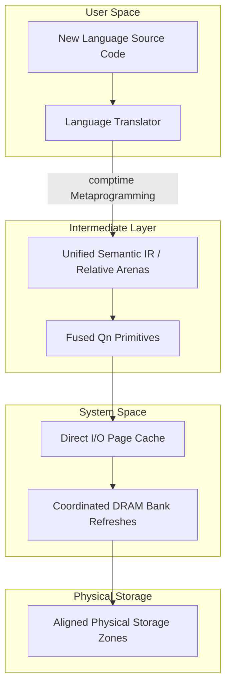

# Chained and Distributed Quang Numbers (CDQN)

[](LICENSE.md)
[]()

> **The Sovereign Core of a Constructivist Computing Stack**

Chained and Distributed Quang Numbers (CDQN) is an exploratory, software-hardware co-designed computing stack built to investigate the mitigation of the physical and logical bottlenecks of modern computer architecture: the **Memory Wall**—the physical latency gap between processors and storage [1.1, 1.30]—and the **Semantic Wall**—the complete erasure of high-level language safety, boundaries, and logical contexts at the physical register and instruction set layers [1.2]. 

Rather than patching legacy systems with increasingly complex software virtual machines and monitoring runtimes, this project explores a new computing stack built upon a **Mathematical Constructivism** foundation [1.18]. It operates on the theoretical inquiry that from Qn primitives [Empirical Horizon], we can build a completely new computing stack composed of a **new coding language** and a **new kind of operating system (OS)**, where program operations prove their spatial, temporal, and semantic safety natively at the register and memory-access layers [1.2, 1.10].

All structural frameworks, conceptual inquiries, and logical constructs presented in this repository are bound by the **Universal Sovereign Source License (USSL) v1.0**.

---

### ⚠️ Development Status Warning

The validated Quang Number (Qn) primitives [Empirical Horizon] described in this repository are currently in an active, exploratory design phase. They are **not in a stable version** and remain completely **open for further corrections, optimizations, and structural updates** as the research progresses through the Series 01 and 02 publication cycles.

---

## 1. System Architecture Inquiries



### 1.1 Inquiries into the Qn Primitives (The Orthogonal Split)
We explore representing the core computational unit of the system not as a single, bloated register word, but as an **Orthogonal Metadata Split [Empirical Horizon]** composed of two physically separate, but logically bound parallel streams to prevent L1 cache contamination and register pressure [1.2, 1.30]:
*   **The Q-Word (Active Data Path):** Carries strictly the lightweight mathematical and semantic parameters, fitting within standard 64-bit or 128-bit vector register widths:
    *   *Value Payload ($v$):* An exact, constructive integer significant to prevent floating-point rounding errors [1.18, 1.40].
    *   *Zoom Factor ($z$):* A structured, floating-scale exponent factor to handle dynamic decimal/scale alignment [1.40].
    *   *Presence Flag (P-Bit):* Explicit optional null-safety, separating value existence from magnitude to eliminate standard sentinel-pointer errors [1.2].
    *   *Deterministic Rounding Flag (R-Bit):* A hardware-enforced execution flag to guarantee $100\%$ reproducible, bit-wise identical mathematical outputs across heterogeneous co-processors [1.1.8, 1.1.9].
    *   *Immutable DOM Seal:* The permanent mathematical domain (Finance, Physics, Maths) that restricts the allowed algebraic operations and units [1.2].
*   **The S-Word (Auxiliary Security Path):** Carries the heavy, security-critical verification and provenance metadata, routed out-of-band to a parallel, dedicated security coprocessor to prevent CPU pipeline stalls [1.9, 1.10]:
    *   *Birth Certificate (The Capability):* The physically-attested, chronologically chained lineage payload containing **Fuzzy Commitment Helper Data** to stabilize physical noise and thermal fluctuations on consumer devices [1.10, 1.23].
    *   *Monotonic Epoch Lease:* A thread-local monotonic sequence that prevents offline file-copying and state-replay exploits without requiring expensive cross-core memory-bus locking [1.10, 1.30, 1.36].
    *   *Monoidal Ownership Lock (O-Bits):* A hardware-enforced lock-count to guarantee zero-overhead, multi-threaded concurrency safety [1.1.5].
    *   *Structural Scope / De-allocation Flag (S-Bit):* A region-based scope-terminator that enables zero-overhead, garbage-collector-free automatic memory reclamation via logical bump-pointer resets [1.10, 1.14].
    *   *Extensible Provenance Semiring Hash:* An out-of-band metadata log that dynamically records semantic events (`Bypass_Marker`, `Saturation_Token`, `Scale_Shift_Token`, `Truncation_Token`) in parallel with the math, maintaining native speed while guaranteeing absolute semantic traceability [1.9, 1.35].

### 1.2 Inquiries into the Platform and Runtime Libraries
*   **The High-to-Low Abstraction Spectrum:** Proposing a unified model where the high-level semantic intent (e.g., vector embeddings, attention caches, and cognitive loops) [1.7, 1.20] compiles down through the intermediate representation (Qn-IR) [Empirical Horizon] without losing structural context, mapping directly to the hardware's Domain-Specific Algebra (DSA) [1.2, 1.15].
*   **Format-Invariant Persistence:** Designing the Qn primitive's layout so that its storage format on disk is completely identical to its execution format in CPU registers, completely eliminating the dynamic runtime serialization, deserialization, and parsing library pipeline [1.12, 1.14].
*   **Loop-Level Provenance Elision:** A compilation optimization pass where the compiler statically analyzes loops and disables active provenance logging inside hot loops, emitting a single, consolidated `Structural Interval Provenance Token` at the exit boundary to achieve bare-metal speed with perfect, unforgeable traceability [1.4, 1.15, 1.44].

---

## 2. Repository Structure & Publication Matrix

To ensure that this exploratory process remains highly structured and modular, the research is partitioned into distinct series of publications, each addressing a specific concern of the computational stack. Below is the modular division of this repository:

```
cdqn/
├── LICENSE.md                  # Universal Sovereign Source License (USSL) v1.0
├── README.md                   # This overview document (Warning: Primitives Non-Stable)
├── docs/
│   ├── 01_qn_design/
│   │   └── 01.1.md             # Foundational primitives and inquiries (v1.1.1)
│   ├── 02_math_proofs/         # [Future] Formal proofs of algebraic boundaries and permutations
│   ├── 03_language_design/     # [Future] Abstract syntax and intermediate representations of the new coding language
│   ├── 04_language_specs/      # [Future] Formal grammar and test specifications of the new coding language
│   ├── 05_system_design/       # [Future] The execution runtime and kernel-level abstractions of the new kind of OS
│   ├── 06_system_specs/        # [Future] System contract and Application Binary Interface of the new kind of OS
│   └── 07_documentation/       # [Future] Consolidated reference manuals and integration guides
└── src/
    └── stage0/                 # [Under Active Development] Software emulation and initial self-bootstrapping tools
```

---

## 3. Cautious Prototyping Roadmap

To bypass the massive barriers of hardware fabrication, our proposed roadmap proceeds through three distinct phases:

*   **Phase 1 (Software Emulation & Progressive Self-Bootstrapping):** We emulate the CDQN stack (`src/stage0/`) on existing, highly optimized commodity consumer SoCs by compiling the intermediate representation directly to standard vector instruction sets (such as standard x86_64 and ARM64 vector extensions), achieving optimal cache-line occupancy and split-load prevention entirely through software-level data-oriented design [1.2, 1.11]. 
    
    Rather than relying on external general-purpose languages to compile our stack, the compiler toolchain is designed to **self-bootstrap progressively**. We begin by writing the most basic, minimalist features and compiler abstractions of the new coding language, and incrementally use each compiled version of the language to build the next, more advanced version. This progressive loop continues until we obtain a fully stable translator that satisfies our validated Proof of Concept (PoC).
*   **Phase 2 (Open Intermediate Standards):** To prevent lock-in to proprietary hardware manufacturer software ecosystems, the intermediate representation is aligned with open industry cross-architecture acceleration standards, ensuring universal portability across all modern accelerator hardware [1.15, 1.17].
*   **Phase 3 (Physical Silicon Co-Design):** Once the software stack is mature, proven, and adopted, the mathematically restricted intermediate primitives will be mapped directly into physical silicon logic gates (ASICs/FPGAs), establishing native registers, hardware-level boundary assertions, and direct memory-mapped streaming [1.2, 1.11].

---

## 4. License

This project is licensed under the **Universal Sovereign Source License (USSL) v1.0** (manifested in [LICENSE.md](LICENSE.md)). 

### Summary of Terms:
*   **Genesis Rights:** Grant perpetual, worldwide, royalty-free usage for **Personal Use**, **Academic Research**, **Non-Profit Education**, or individual creation.
*   **The Intellectual Peace Treaty (Iron Shield):** Any patent litigation, copyright strikes, or trade-secret disputes instigated by a licensee against the CDQN project immediately and retroactively terminates all rights granted under this license.
*   **Industrial Thresholds:** Commercial or institutional entities must enter a separate **Commercial Partnership Agreement** if:
    1.  Annual gross revenue generated by a derivative work exceeds **$1,000,000 USD** (or local equivalent).
    2.  The project services more than **10,000 monthly active users** or nodes.
    3.  It is deployed by corporations with more than 500 employees, or governmental bodies.

For commercial licensing inquiries, contact the author via the official repository channels [github.com/cdqn5249/cdqn](https://github.com/cdqn5249/cdqn).

---

## References

*   **[1.1]** Wulf, W. A., & McKee, S. A. *"Hitting the Memory Wall: Implications of the Obvious."* ACM SIGARCH Computer Architecture News, vol. 23, no. 1, pp. 20-24, 1995.
*   **[1.2]** Purdue University HexHive Group. *"The Semantic Gap: Deconstructing the Boundary Between High-Level Languages and Machine Semantics."* ACM Computing Surveys, vol. 53, no. 4, pp. 1-36, 2020.
*   **[1.3]** Bessemer Venture Partners. *"The AI Data Center Stack: Managing Energy, Cooling, and Hardware Constraints."* BVP Industry Insights, May 2026.
*   **[1.4]** Aho, A. V., Lam, M. S., Sethi, R., & Ullman, J. D. *"Compilers: Principles, Techniques, and Tools."* 2nd ed., Addison-Wesley, 2006.
*   **[1.5]** Tanenbaum, A. S., & Bos, H. *"Modern Operating Systems."* 4th ed., Pearson, 2015.
*   **[1.6]** Goldberg, D. *"What Every Computer Scientist Should Know About Floating-Point Arithmetic."* ACM Computing Surveys, vol. 23, no. 1, pp. 5-48, 1991.
*   **[1.7]** Mei, K. et al. (Rutgers University). *"AIOS: LLM Agent Operating System."* Proceedings of the 2nd Conference on Language Modeling (COLM 2025), Oct 2025.
*   **[1.9]** Abdelnabi, S. et al. *"Execute-Only Agents: Architectural Defense Against Prompt Injection for AI Agents."* ASPLOS, 2026.
*   **[1.10]** Devriese, D. et al. *"Reasoning About Object Capabilities: Formal Verification of Security Invariants in Capability-Secure Languages."* ACM TOPLAS, 2021.
*   **[1.11]** Lattner, C., & Adve, V. *"LLVM: A Compilation Framework for Lifelong Program Analysis & Transformation."* Proceedings of the International Symposium on CGO, 2004.
*   **[1.12]** *TeraHeap: Off-Heap Memory Management to Eliminate Serialization/Deserialization Overhead in Big Data Runtimes.* IEEE Transactions on Parallel and Distributed Systems, vol. 33, no. 11, pp. 2845-2860, 2022.
*   **[1.14]** Howard, S. *"Symas LMDB: Engineering Zero-Copy Read-Scalability on Memory-Mapped Storage."* Symas Corporation Technical Report, 2021.
*   **[1.15]** Lattner, C. et al. *"MLIR: Scaling Compiler Infrastructure for Heterogeneous Accelerators."* Proceedings of the IEEE/ACM CGO, 2021.
*   **[1.17]** Unified Acceleration (UXL) Consortium. *"oneAPI Specification: A Unified, Cross-Architecture Programming Model for Accelerators."* Linux Foundation, Mar 2026.
*   **[1.18]** Bishop, E. *"Foundations of Constructive Analysis."* McGraw-Hill, New York, 1967.
*   **[1.19]** Conway, J. H. *"On Numbers and Games."* Academic Press, London, 1976.
*   **[1.20]** Wolfram, S. *"What Is ChatGPT Doing... and Why Does It Work?"* Wolfram Media, Inc., 2023.
*   **[1.21]** Bender, E. M. et al. *"On the Dangers of Stochastic Parrots: Can Language Models Be Too Big?"* Proceedings of the ACM FAccT Conference, Mar 2021.
*   **[1.22]** Pope, R. et al. *"Efficiently Scaling Transformer Inference."* Proceedings of the 6th MLSys Conference, Jun 2023.
*   **[1.23]** Synopsys. *"SRAM Physical Unclonable Functions (PUFs) and their Benefits for Security."* Security Technology Whitepapers, Dec 2025.
*   **[1.30]** Mutlu, O. *"A Modern Outlook on Memory-Centric Computing Architectures."* Proceedings of the IEEE ICCD, Oct 2023.
*   **[1.35]** Spivak, D. I. *"Category Theory for the Sciences."* MIT Press, 2014.
*   **[1.36]** Fong, B., & Spivak, D. I. *"An Invitation to Applied Category Theory."* Cambridge University Press, 2019.
*   **[1.40]** *Tapered Precision Arithmetic and Floating-Scale Fixed-Point Systems for DSP and AI Accelerators.* IEEE Transactions on Computers, vol. 73, no. 2, pp. 412-426, Feb 2025.
*   **[1.44]** Green, T. J., Karvounarakis, G., & Tannen, V. *"Provenance Semirings."* Proceedings of the 26th ACM PODS, Jun 2007.
